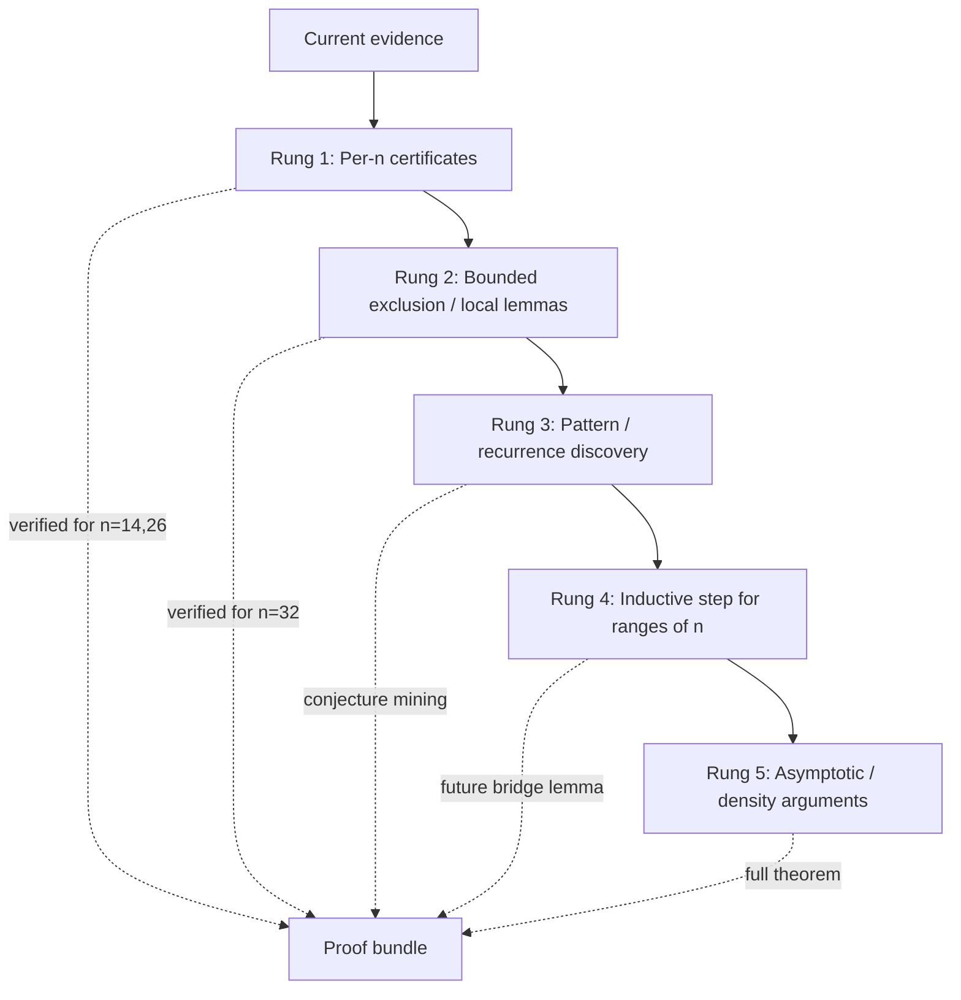

# Proof Program for Erd\u0151s Problem #91

This document translates the current evidence into a path toward a true solution.

## Target Statement

Goal: prove that there exists N such that for every n >= N, the minimizer set for distinct distances in no-three-collinear planar n-point sets has at least two Euclidean similarity classes.

Current status in this repository:
- Strong computational witnesses for selected n.
- Exact objective certification for sampled candidates.
- No theorem over all sufficiently large n yet.

## Gap 1: Asymptotic Theorem for All Large n

Missing piece:
- A proof that the non-uniqueness phenomenon holds for every n beyond a threshold, not just tested n.

Required mathematical structure:
1. A structural description of minimizers (or near-minimizers) in a regime of large n.
2. A transfer principle that promotes finite verified patterns to all larger n.
3. A stability theorem: near-minimizers lie in a controlled geometric family.

Concrete plan:
1. Establish a constrained model class C_n capturing known extremal geometry (for example cyclic or near-cyclic templates with perturbation parameters).
2. Prove two distinct parameter branches in C_n both attain m_n for all large n.
3. Prove any minimizer outside C_n has objective strictly larger than m_n for large n.
4. Conclude at least two non-similar minimizers for all n >= N.

Immediate computational support tasks:
- Track candidate branch fingerprints across n and look for persistent branch continuation.
- Measure objective gaps between branch minima and best out-of-branch samples.
- Locate candidate threshold N where dual-branch behavior stabilizes.

## Gap 2: Exact Non-Similarity Certification

Missing piece:
- A rigorous argument that witness pairs are truly non-similar in the exact geometric sense.

What the current pipeline already gives:
- Shape-distance separation and signature mismatch, which are strong but numerical diagnostics.

Upgrade path to rigorous certification:
1. Use exact invariants under similarity that can be certified from exact arithmetic data.
2. For each witness pair, certify mismatch of at least one invariant that is provably similarity-invariant.
3. Produce machine-checkable certificates with interval or symbolic bounds.

Candidate invariant ladder (strongest first):
1. Exact multiset of normalized angle-based invariants.
2. Exact rank profile of Gram matrix up to scaling.
3. Certified mismatch in a canonical polynomial invariant tuple.
4. As fallback, interval-certified lower bound on Procrustes distance strictly above zero.

Practical implementation target in this repo:
- Extend witness payloads with certified invariant values and a proof object indicating which invariant separates A and B.

## Gap 3: Eliminating Unseen Minimizers

Missing piece:
- A guarantee that no unobserved configuration outside the explored search region beats or ties known witnesses in a way that destroys the conclusion.

Required argument type:
- Completeness or covering argument over configuration space modulo similarity.

Candidate rigorous strategies:
1. Branch-and-bound over normalized configuration space with interval bounds on objective.
2. Semialgebraic decomposition plus exact lower bounds per cell.
3. Certified epsilon-net covering modulo similarity with objective Lipschitz bounds.

Computational theorem template:
- For fixed n, partition normalized configuration space into cells.
- Certify lower bound L(cell) on distinct-distance objective for each cell.
- Show only cells containing known branches can attain m_n.
- Certify at least two non-similar minimizers among those cells.

This yields a per-n theorem, which can then be lifted via an asymptotic argument.

## Recommended Work Packages

WP1: Per-n rigorous certificates
- Deliverable: for each target n, a certificate bundle proving at least two non-similar minimizers at value m_n.
- Components: exact objective proofs, exact non-similarity invariant proofs, and local optimality checks.

WP2: Exhaustive exclusion engine
- Deliverable: certified branch-and-bound exclusions for all non-witness cells at each target n.
- Components: interval arithmetic bounds, pruning logs, machine-checkable proof traces.

WP3: Asymptotic lift
- Deliverable: proof that the dual-branch mechanism persists for all n >= N.
- Components: branch continuation lemma, stability lemma, exclusion lemma.

## Acceptance Criteria for a True Solution

The project can claim a true solution only when all are met:
1. Theorem over all n >= N with a complete proof.
2. Exact non-similarity certificate for each branch pair used in the theorem.
3. Completeness argument excluding unseen minimizers that could invalidate non-uniqueness.

## What This Repo Should Produce Next

Near-term artifacts to close the gap fastest:
1. A per-n formal certificate format with explicit proof objects.
2. A certified non-similarity checker based on exact invariants.
3. A bounded, auditable exclusion run for a first hard n (for example n=14 or n=26).
4. A draft theorem statement with hypotheses tied exactly to those certified artifacts.

These four artifacts bridge computational evidence to proof-grade mathematics.

## Proof Ladder Architecture

The proof program is now organized as a ladder rather than a static snapshot.
Each rung is a measurable milestone, and each bundle should say which rung(s)
it satisfies.

Dynamic ladder rule:

- Each new artifact should list completed rungs, partial rungs, and the next
	rung to attack.
- The manifest in [proof_ladder_manifest.json](proof_ladder_manifest.json)
is the machine-readable source of truth for the ladder state.
- The generated summary in [ladder_status.md](ladder_status.md) is the current
readable snapshot.
- The structural pattern ledger in [results/pattern_ledger_91.md](results/pattern_ledger_91.md)
tracks which witness families, consensus plateaus, and exclusion gaps are
actually recurring.

## Highest-Impact Formal Upgrade (Implemented Direction)

The strongest immediate improvement to formal progress is to turn non-similarity
from shape-distance evidence into equation-level invariant contradiction checks.

For a candidate set P = {p_i} and Q = {q_i}, any similarity map

T(x) = s R x + t,  s > 0,  R in O(2),

must preserve the normalized invariants below.

### Equation Set

1. Normalized squared-distance multiset

	d_ij(P) = ||p_i - p_j||^2,
	Delta(P) = { d_ij(P) / min_{a<b} d_ab(P) : i < j }.

2. Normalized squared doubled-area multiset

	A_ijk(P) = det(p_j - p_i, p_k - p_i),
	Alpha(P) = { A_ijk(P)^2 / min_{a<b<c, A_abc!=0} A_abc(P)^2 : i < j < k, A_ijk != 0 }.

3. Centered Gram eigenvalue ratios

	X(P) = centered coordinate matrix,
	G(P) = X(P) X(P)^T,
	Lambda(P) = nonzero_eigs(G(P)) / max(nonzero_eigs(G(P))).

If any one of Delta(P) != Delta(Q), Alpha(P) != Alpha(Q), Lambda(P) != Lambda(Q),
then P and Q are provably non-similar.

### Why This Is Highest Impact

- It upgrades WP1 immediately without waiting for asymptotic machinery.
- It is machine-checkable and composable in certificate JSON proof objects.
- It gives per-n theorem-grade contradiction checks for witness pairs.

### Next Proof-Milestone Sequence

1. Produce upgraded witness certificates with all three invariant checks for n=14 and n=26.
2. Freeze a verifier log format and require strict pass in CI-style replay.
3. Add interval-bounded tolerance claims (explicit error budgets) for each invariant comparison.
4. Package a per-n theorem draft: exact objective equality + invariant mismatch + reproducible verifier transcript.

This sequence gives the largest near-term jump in formal maturity per unit work,
while remaining compatible with later exhaustive-exclusion and asymptotic-lift steps.

## Bounded Exclusion Baseline (Completed)

A first auditable exclusion log has been generated for n=32 at
[results/erdos91_exclusion_n32_v1.md](results/erdos91_exclusion_n32_v1.md).

Observed fixed-n facts in that report:

- certified minimizers in scope: 62
- exact-valid rows with larger exact objective: 456
- next-best exact distinct squared-distance count: 485
- exact objective gap to next-best: 1

This is the right shape of proof artifact for WP2: it records a bounded,
machine-checkable pruning log over the explored exact-valid rows. It is still not
a global completeness proof over the full configuration space, but it closes the
first auditable exclusion slice.

## Ways to Get Closer From Here

The fastest path now is to convert the bounded exclusion slice into a genuine
cell-level proof skeleton and to sharpen the per-n witness certificates so they
carry formal contradiction data rather than only evidence-grade separation.

1. Lift row-level exclusion to cell-level exclusion.

	Partition a normalized configuration chart into small cells and attach a lower
	bound L(cell) on the exact objective or on a certified proxy objective.
	The key goal is to prove that every cell not containing the known witness
	branches has L(cell) > m_n.

2. Turn invariant mismatch into certified inequalities.

	For each witness pair, store explicit lower bounds on invariant gaps such as

	|Delta(P) - Delta(Q)|, |Alpha(P) - Alpha(Q)|, and |Lambda(P) - Lambda(Q)|.

	This makes the non-similarity claim closer to a formal contradiction rather
	than a post hoc comparison.

3. Add a branch continuation table across n.

	Track the witness families that recur at n=14, 26, 32, and nearby values,
	then record which invariant signatures persist under n -> n+2 or n -> n+4.
	This is the best route toward the asymptotic lift in WP3.

4. Separate certified minimizers from uncertified search noise.

	The n=32 exclusion log already shows the exact shape of this split:
	certified minimizers at the best value, exact-valid rows above the best value,
	and uncertified rows that must be excluded from proof claims.

5. Add an independent verifier transcript.

	A second, simpler checker for the same proof-object fields reduces the risk of
	shared bugs in the main verifier and is the most realistic next hardening step.

6. Use a small hard n as a proof pilot.

	Best candidates are n=14 or n=26 for witness certificates and n=32 for
	exclusion structure. A pilot theorem package should be built around one of
	these n values before generalizing.

In short: the shortest path to a stronger result is cell-level exclusion +
certified invariant gaps + a pilot theorem bundle for one hard n.

For the explicit rung-4/rung-5 proof-obligation checklist, see
[BRIDGE_OBLIGATIONS_91.md](BRIDGE_OBLIGATIONS_91.md).

The first machine-readable bridge-step artifacts are now available at
[results/bridge_step_hypothesis_91.json](results/bridge_step_hypothesis_91.json)
and
[results/bridge_step_verification_91.md](results/bridge_step_verification_91.md).
They currently certify a finite surrogate transition 22->26 while marking
22->24 and 24->26 as blocked until n=24 yields a witness pair.

The transfer-lemma composition artifacts are available at
[results/bridge_transfer_proof_91.json](results/bridge_transfer_proof_91.json)
and
[results/bridge_window_composition_91.md](results/bridge_window_composition_91.md).
These encode the current status as surrogate-certified on window [22,32], with
n->n+2 still blocked by the missing n=24 witness transition.

Dual-track bridge results are now also published:
- strict track:
	[results/bridge_transfer_proof_91_strict.json](results/bridge_transfer_proof_91_strict.json)
	and
	[results/bridge_window_composition_91_strict.md](results/bridge_window_composition_91_strict.md)
- family-flex track:
	[results/bridge_transfer_proof_91_family_flex.json](results/bridge_transfer_proof_91_family_flex.json)
	and
	[results/bridge_window_composition_91_family_flex.md](results/bridge_window_composition_91_family_flex.md)

In this update, strict remains surrogate-certified while family-flex reaches
n+2-certified on the tested window.

Family-flex extension attempt to the next window is tracked in
[results/bridge_step_hypothesis_91_family_flex_window2.json](results/bridge_step_hypothesis_91_family_flex_window2.json),
[results/bridge_step_verification_91_family_flex_window2.md](results/bridge_step_verification_91_family_flex_window2.md),
[results/bridge_transfer_proof_91_family_flex_window2.json](results/bridge_transfer_proof_91_family_flex_window2.json),
and
[results/bridge_window_composition_91_family_flex_window2.md](results/bridge_window_composition_91_family_flex_window2.md).
Current result: window [26,30] remains blocked because n=28 and n=30 do not yet
produce witness pairs under the current tighter tolerance checks.

## Best Available Proof Bundle

For the strongest currently certified proof-style artifact, see
[PROOF_BUNDLE_91.md](PROOF_BUNDLE_91.md). It packages the verified per-n
non-similarity certificates and the bounded exclusion result into a single
theorem-style document.
